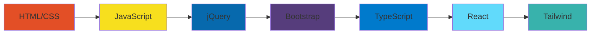

# 🚀 Olá, eu sou Pedro Dutra!

<div align="center">
  
</div>

## 🎯 Sobre Mim

Sou um desenvolvedor frontend apaixonado por criar experiências digitais incríveis! Atualmente estou em uma jornada de evolução constante, explorando as tecnologias mais modernas do ecossistema web. Já estou trabalhando com TypeScript e sempre buscando aprender mais!

## 🛠️ Stack Tecnológica

### 🎨 **Fundamentos Sólidos**


### 🚀 **Frameworks & Bibliotecas**


### 🔥 **Em Aprendizado Ativo**


## 📈 Jornada de Aprendizado



## 🎨 Projetos em Destaque

<table>
  <tr>
    <td width="50%">
      <h3 align="center">⏰ Pomodoro Flow</h3>
      <p align="center">
        <a href="https://github.com/PedroDRT/pomodoro-flow" target="_blank">
          
        </a>
        <p align="center">
          <a href="https://github.com/PedroDRT/pomodoro-flow" target="_blank">
            
          </a>
        </p>
        <p align="center">Aplicação de gerenciamento de tempo usando a técnica Pomodoro</p>
      </p>
    </td>
    <td width="50%">
      <h3 align="center">🪙 Crypto Money</h3>
      <p align="center">
        <a href="https://github.com/PedroDRT/crypto-money" target="_blank">
          
        </a>
        <p align="center">
          <a href="https://github.com/PedroDRT/crypto-money" target="_blank">
            
          </a>
        </p>
        <p align="center">Aplicação para acompanhamento de criptomoedas</p>
      </p>
    </td>
  </tr>
</table>

## 📊 Estatísticas do GitHub

<div align="center">
  
  
</div>

## 🎯 Metas para 2024

- [x] ✅ Dominar TypeScript (em progresso!)
- [ ] ⚛️ Criar projetos com React
- [ ] 🎨 Explorar Tailwind CSS
- [ ] 🔗 Contribuir para projetos open source
- [ ] 🚀 Aprender Next.js
- [ ] 🎯 Melhorar Pomodoro Flow e Crypto Money

## 🚀 Habilidades em Desenvolvimento

<div align="center">
  
</div>

## 📫 Vamos Conectar!

<div align="center">
  <a href="https://github.com/PedroDRT">
    
  </a>
  <a href="mailto:seu.email@exemplo.com">
    
  </a>
  <a href="https://linkedin.com/in/seu-perfil">
    
  </a>
</div>

## 💡 Fun Fact

```typescript
const developer: Developer = {
  name: "Pedro Dutra",
  passion: "Frontend Development",
  currentFocus: "TypeScript + React + Tailwind",
  funFact: "Transformo café ☕ em código TypeScript 💻",
  motto: "Cada linha de código é uma oportunidade de aprendizado!",
  github: "@PedroDRT"
};

console.log("🚀 Vamos criar algo incrível juntos!");
```

## 🌟 Destaques

- **2 repositórios** ativos no GitHub
- **10 seguidores** e **13 seguindo** - networking ativo!
- Projetos em **TypeScript** mostrando evolução técnica
- Foco em **produtividade** (Pomodoro) e **fintech** (Crypto)

---

<div align="center">
  
  
  ⭐ Se este README te inspirou, deixe uma estrela!
</div>
